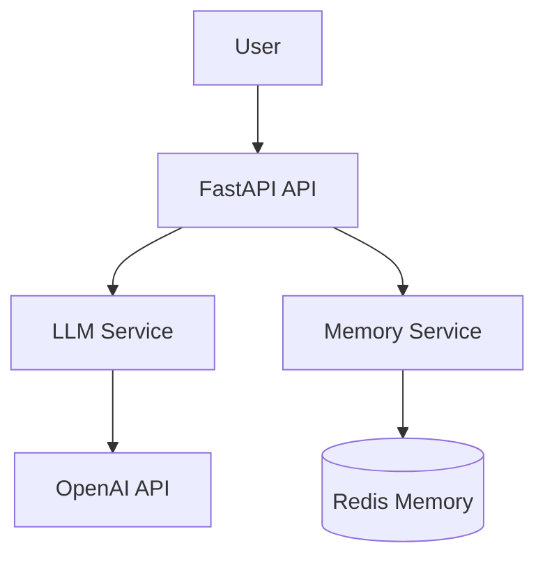

# Modular LLM Assistant Backend

A professional, scalable backend for an AI-powered assistant, built with FastAPI, LangChain, and Redis.

## Architecture



## Features
- **Scalable API**: Built with FastAPI for high performance.
- **Persistent Memory**: Redis-backed conversation history management.
- **LLM Integration**: Seamless interaction with OpenAI via LangChain.
- **Voice-Ready**: Extensible architecture to support voice-to-text and text-to-voice integrations.
- **Containerized**: Docker and Docker Compose support for easy deployment.

## Setup Guide

### Prerequisites
- Python 3.9+
- Redis Server
- OpenAI API Key

### Local Installation
1. Clone the repository:
   ```bash
   git clone https://github.com/Mane2518/modular-llm-assistant-backend.git
   cd modular-llm-assistant-backend
   ```
2. Create a virtual environment:
   ```bash
   python -m venv venv
   source venv/bin/activate  # On Windows: venv\Scripts\activate
   ```
3. Install dependencies:
   ```bash
   pip install -r requirements.txt
   ```
4. Create a `.env` file:
   ```env
   OPENAI_API_KEY=your_api_key_here
   REDIS_HOST=localhost
   REDIS_PORT=6379
   ```
5. Run the application:
   ```bash
   uvicorn app.main:app --reload
   ```

### Docker Deployment
```bash
docker-compose up --build
```

## API Endpoints
- `POST /api/chat`: Send a message and get a response.
- `GET /api/memory/{session_id}`: Retrieve conversation history.
- `DELETE /api/memory/{session_id}`: Clear conversation history.
